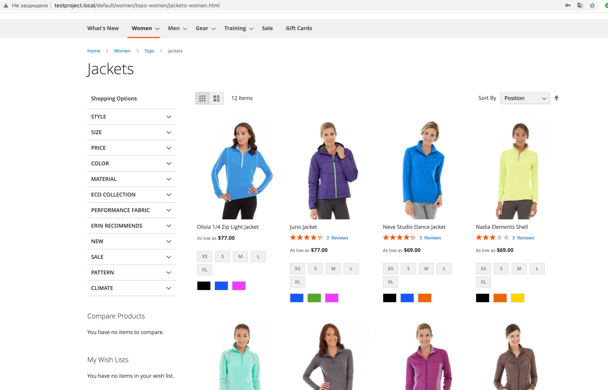
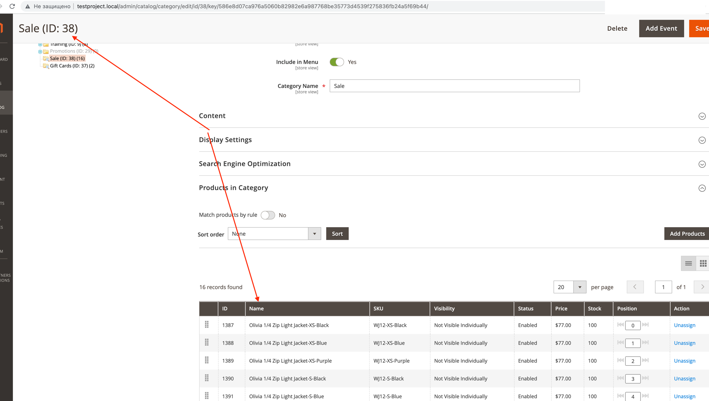
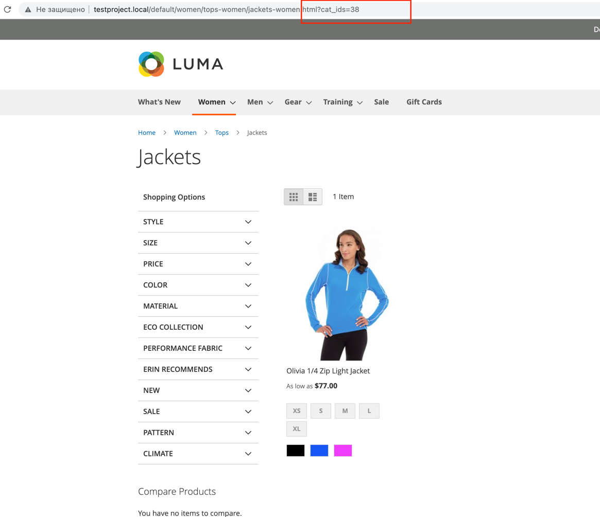

***ReadyToGo_CategoryFilter***

Task: we need to display only products that are added to several categories on product listing page

To enable this module execute:
- `composer require eugene-petrov/magento2-category-filter`
or if the cmd above is not working: `composer config repositories.readyToGoCategoryFilter vcs git@github.com:eugene-petrov/magento2-category-filter.git`
- `php bin/magento setup:upgrade`
- `php bin/magento cache:clean`

**Example**

_Preconditions_: magento sample data is installed

Let's imagine that we are on a category page like this one:

And we need a filter to find out which products (from this particular category) are on sale (assigned to the Sale category).

To make it done, let's specify a parameter in the URL `cat_ids` with category id (or ids) which we need and observe the result:

This is it. Now we can build something on top of this implementation.
